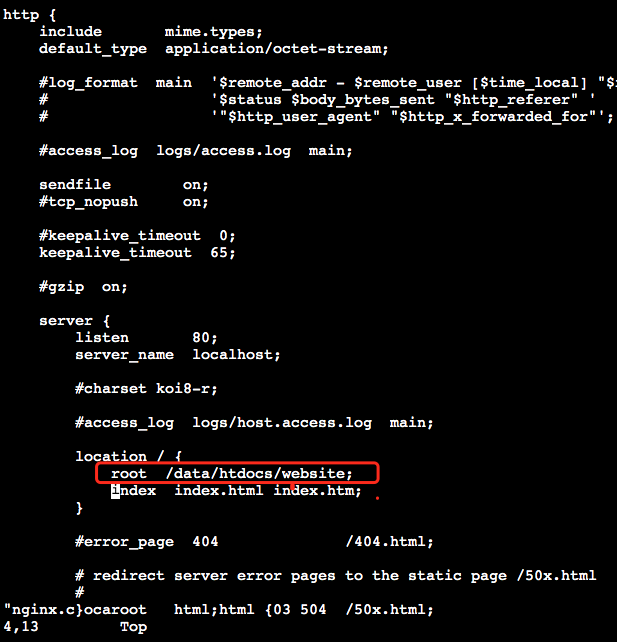

# Linux服务器部署前端项目到外网访问

   
  
   
   

### Linux服务器端安装Nginx

#### 1、下载：
> $ wget http://nginx.org/download/nginx-1.13.6.tar.gz
#### 2、解压缩
> $ tar -zvxf nginx-1.13.6.tar.gz

> $ cd nginx-1.13.6

#### 3、安装：
> $ ./configure

> $ make

> $ make install

#### 4、nginx前端项目代理地址配置

在cd /usr/local/nginx/conf目录下配置nginx.conf文件只要修改root即可，（root为项目打包后文件的存放路径。），服务器端前端项目路径：/data/htdocs/website

> $ cd /usr/local/nginx/conf 

> $ vim nginx.conf     //进入编辑模式

修改配置代码如下

退出编辑模式：esc 

:wq 保存并退出

#### 4、启动程序：
> $ cd /usr/local/nginx/sbin/

> $ ./nginx

## 其他命令：

#### 5、停止Nginx
> $ ./nginx -s stop

#### 6、查看运行状态

> $ ps aux | grep nginx

#### 7、检查配置文件是否正确

> $ ./nginx –t

#### 8、查看nginx版本
> $ ./nginx -v

#### 9、配置文件位置

> $ /usr/local/nginx/conf/nginx.conf

### 安装遇到的问题：
如提示错误信息：make: *** No rule to make target `build', needed by `default'.  Stop.

解决Centos7 解决安装Nginx编辑make && make install的不成功
解决方案

#### 1、安装下面配置

> $ yum -y install make zlib-devel gcc-c++ libtool openssl openssl-devel

#### 2、重新configure

> $ ./configure 

#### 3、编译
> $ make && make install

### [官网访问地址](http://120.53.243.104)
