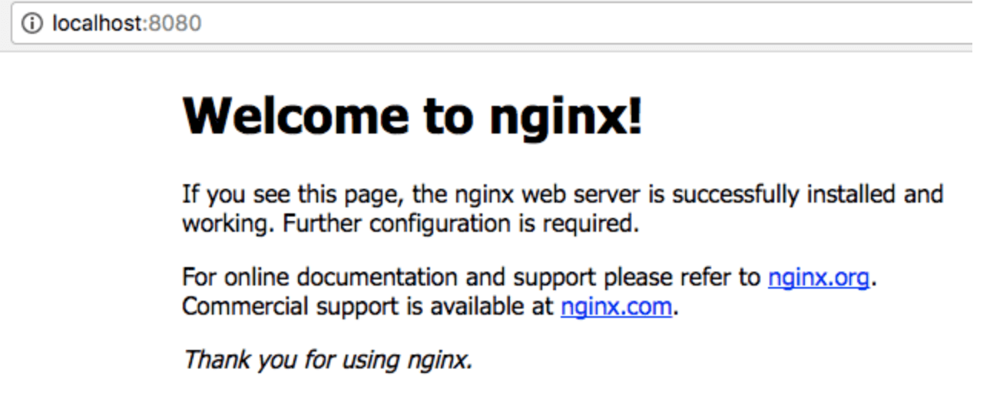

# Mac安装nginx配置本地项目跨域过程

<p align="center">
  <br>
  
  <br>
  <br>
</p>
前端本地设置代理，采用Nginx服务

## 安装Nginx步骤：

#### 1、打开终端
#### 2、安装Command Line tools

> $ xcode-select --install

#### 3、安装brew命令
> $ ruby -e "$(curl -fsSL https://raw.githubusercontent.com/Homebrew/install/master/install)"
#### 4、安装nginx
> $ brew install nginx
#### 5、启动nginx
> $ sudo nginx

OK, nginx就安装好了，可以在浏览器访问了，默认端口为8080，
在浏览器输入 http://localhost:8080 就能看到nginx在本计算机搭建的服务器



#### 6、 设置反向代理地址，准备编辑nginx的配置文件：
> vim /usr/local/etc/nginx/nginx.conf

进入nginx.conf页面后，按 “i" 键进入编辑状态


### 说明：
 （1）nginx的访问端口可以修改为没被占用的其他端口，这里设置nginx的访问路径是  http://localhost:8080

 （2）注意这里需要添加 proxy_pass 为本地运行的项目地址 http://localhost:8888 ！！！  当访问 http://localhost:8080 的时候，location会匹配 ' / ' 到文件夹根目录下的index.html文件，但这里添加  proxy_pass 后，访问 http://localhost:8080  的时候会代理到 http://localhost:8888，而且你的访问路径显示的还是 http://localhost:8080 ，内容是 http://localhost:8888的项目

 （3）这里location匹配的是 访问  http://localhost:80/dev-api/.*   路径的时候，在proxy_pass填上需要用到的外域api地址  http://nbiot.yuehuizhineng.com/  ，此时就相当于访问：http://nbiot.yuehuizhineng.com/ .*  ，但实际上显示在你眼前的还是原来路径： http://localhost:80/dev-api/.*  ，只是你访问这个原路径的时候nginx自动帮你代理到你想要访问的api路径 。但这里有个很重要的细节需要注意： 匹配路径  /dev-api/  和代理路径  http://nbiot.yuehuizhineng.com/  后面的斜杠统统都不能少！！！任何一个少了都不行，这是nginx的规则。

#### 本地项目vue.config.js代码：

```
module.exports = {
    devServer: {
        port: 8888,
        host: "localhost", //
        https: false, // 协议
        open: true,  //启动服务时自动打开浏览器访问
        proxy: { //开发环境代理配置
            [process.env.VUE_APP_BASE_API]: {
                target: process.env.VUE_APP_SERVICE_URL,  // 目标服务器
                changeOrigin:true , //开启代理服务器
                pathRewrite: {
                    ['^' + process.env.VUE_APP_BASE_API]: ''
                }
            }
        }
    },
    lintOnSave: false, //关闭格式检查
    productionSourceMap: false //打包不会生成 .map 文件 加快打包速度
}
```

修改完 nginx.conf 文件后，需要重启nginx ，才会生效 ！！！
#### 7、按esc键退出编辑状态，输入 :wq 保存并退出nginx.conf页面
#### 8、重新启动nginx
> sudo nginx -s reload

#### 注意：本地项目配置和访问方式：

本地项目中，我访问接口以这样的格式： /dev-api/.*，然后运行本地项目后，访问 http://localhost:8080 地址，而不是 http://localhost:8888 。

直接访问 http://localhost:8888 不会通过 nginx中转，而访问 http://localhost:8080 通过nginx中转解决了跨域问题。


