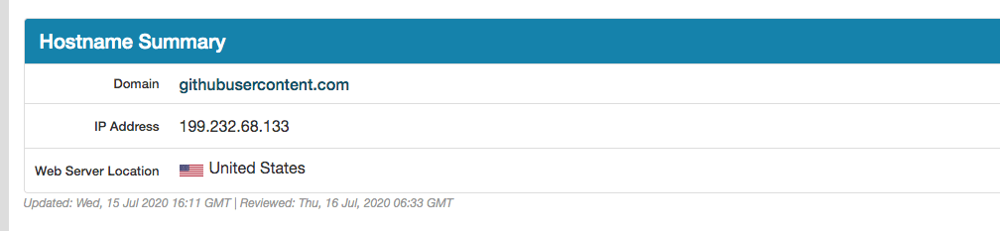

# 解决github图片不显示的问题（Mac版）

   
  
   
   

### 提交到GitHub上的图片发现无法访问，如图所示:

### 在网上查了一下，主要思路解决方法如下：

> 就是使用本地hosts文件对网站进行域名解析，一般的DNS问题都可以通过修改hosts文件来解决，github的CDN域名被污染问题也不例外，同样可以通过修改hosts文件解决，将域名解析直接指向IP地址来绕过DNS的解析，以此解决污染问题。

### 1、找到GitHub上图片的域名

使用Google浏览器，右击”检查“，

点击”open in new tab“ 打开图片链接： https://raw.githubusercontent.com/ShiYaoHua/personalBlog/master/img/4_1.png?token=ABXPYHXNV4IM43QWY5V52CS7CAAHE

复制域名：raw.githubusercontent.com

### 2、[到IPAddress.com网站](https://www.ipaddress.com/) 

复制域名进去解析ip地址：199.232.68.133

### 3、修改hosts

前往文件夹 /etc 打开hosts文件 添加 

> 199.232.68.133  raw.githubusercontent.com

如图所示（我只添加了一个，不同项目图片域名可能也不同，其他所有图片域名解析后的ip地址都添加进去就可访问了）：

